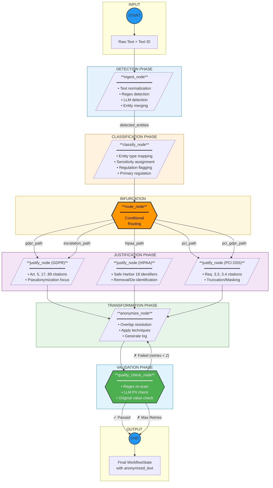

# LangGraph Workflow Architecture

```mermaid
flowchart TD
    subgraph INPUT["INPUT"]
        START((START))
        raw_text["Raw Text + Text ID"]
    end
    
    START --> raw_text
    raw_text --> ingest 
    
    subgraph DETECTION["DETECTION PHASE"]
        ingest[/"**ingest_node**<br/>━━━━━━━━━━━━━━━<br/>• Text normalization<br/>• Regex detection<br/>• LLM detection<br/>• Entity merging"/]
    end
    
    ingest --> |"detected_entities"| classify
    
    subgraph CLASSIFICATION["CLASSIFICATION PHASE"]
        classify[/"**classify_node**<br/>━━━━━━━━━━━━━━━<br/>• Entity type mapping<br/>• Sensitivity assignment<br/>• Regulation flagging<br/>• Primary regulation"/]
    end
    
    classify --> route
    
    subgraph ROUTING["BIFURCATION"]
        route{{"**route_node**<br/>━━━━━━━━━━━━<br/>Conditional<br/>Routing"}}
    end
    
    route --> |"gdpr_path"| justify_gdpr
    route --> |"hipaa_path"| justify_hipaa
    route --> |"pci_path"| justify_pci
    route --> |"pci_gdpr_path"| justify_pci
    route --> |"escalation_path"| justify_gdpr
    
    subgraph JUSTIFICATION["JUSTIFICATION PHASE"]
        justify_gdpr[/"**justify_node (GDPR)**<br/>━━━━━━━━━━━━━━━<br/>• Art. 5, 17, 89 citations<br/>• Pseudonymization focus"/]
        justify_hipaa[/"**justify_node (HIPAA)**<br/>━━━━━━━━━━━━━━━<br/>• Safe Harbor 18 identifiers<br/>• Removal/De-identification"/]
        justify_pci[/"**justify_node (PCI DSS)**<br/>━━━━━━━━━━━━━━━<br/>• Req. 3.3, 3.4 citations<br/>• Truncation/Masking"/]
    end
    
    justify_gdpr --> anonymize
    justify_hipaa --> anonymize
    justify_pci --> anonymize
    
    subgraph TRANSFORMATION["TRANSFORMATION PHASE"]
        anonymize[/"**anonymize_node**<br/>━━━━━━━━━━━━━━━<br/>• Overlap resolution<br/>• Apply techniques<br/>• Generate log"/]
    end
    
    anonymize --> quality
    
    subgraph VALIDATION["VALIDATION PHASE"]
        quality{{"**quality_check_node**<br/>━━━━━━━━━━━━━━━<br/>• Regex re-scan<br/>• LLM PII check<br/>• Original value check"}}
    end
    
    quality --> |"✓ Passed"| output
    quality --> |"✗ Failed (retries < 2)"| anonymize
    quality --> |"✗ Max Retries"| output
    
    subgraph OUTPUT["OUTPUT"]
        output((END))
        final_state["Final WorkflowState<br/>with anonymized_text"]
    end
    
    output --> final_state

    style route fill:#ff9800,stroke:#333,stroke-width:3px,color:#000
    style quality fill:#4caf50,stroke:#333,stroke-width:2px,color:#fff
    style START fill:#2196f3,stroke:#333,stroke-width:2px
    style output fill:#2196f3,stroke:#333,stroke-width:2px
    style DETECTION fill:#e3f2fd,stroke:#1976d2
    style CLASSIFICATION fill:#fff3e0,stroke:#f57c00
    style ROUTING fill:#fff8e1,stroke:#ff9800
    style JUSTIFICATION fill:#f3e5f5,stroke:#7b1fa2
    style TRANSFORMATION fill:#e8f5e9,stroke:#388e3c
    style VALIDATION fill:#e1f5fe,stroke:#0288d1
```
